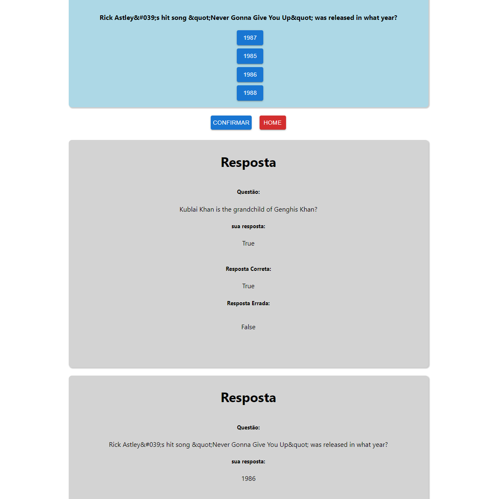

# AppQUIZ

O projeto **AppQuiz** foi desenvolvido durante o **Um case**, com o intuito de avaliar de forma prática os meu conhecimento.

<h1 align="center">
Fotos do projeto
</h1>





---

# Índice

- [Descrição](#-descrição-do-projeto)
- [Como acessar o projeto](#-como-acessar-o-projeto)
- [Tecnologias utilizadas](#-tecnologias-utilizadas)
- [Instalação](#-como-baixar-o-projeto)

---

## 🖋 Descrição do projeto

O desafio proposto pelo projeto era desenvolver uma aplicação de um jogo entre perguntas e respostas onde ao final de todas as perguntas respondidas, o usuário pudesse ver um "relatório" das respostas certas e erradas, e ao retornar para a página inicial o usuário tivesse acesso ao último relatório salvo, contendo a resposta correta e a resposta que foi escolhida por ele.

---

## 🌎 Como acessar o projeto

- [Link do Projeto Deploy](https://61a3a1bbf23307110b8c1dd4--infallible-swirles-49f136.netlify.app)

## 🚀 Tecnologias utilizadas

o projeto foi desenvolvido usando as seguintes tecnologias:

- [React.js](https://pt-br.reactjs.org/docs/getting-started.html)
- [Styled-Components](https://styled-components.com/docs)
- [Hooks](https://pt-br.reactjs.org/docs/hooks-intro.html)
- [ContextApi](https://pt-br.reactjs.org/docs/hooks-reference.html#usecontext)
- [React-router-Dom V6](https://morioh.com/p/1dee5f557fa9)
- [History](https://www.npmjs.com/package/history)
- [Axios](https://axios-http.com/docs/intro)

---

## 💾 Como baixar o projeto

- Primeiro instale o [Git](https://git-scm.com/), [Node.jS](https://nodejs.org/pt-br/download/) + [npm](https://www.npmjs.com/get-npm)

```bash
# Clonar o repositório
git clone https://github.com/juliosan-bit/AppQuiz.git
# Entrar no diretório
cd AppQuiz

# Instalar as dependências
npm install  

# Rodar o projeto
npm run start
```

Feito com muito empenho e dedicação por - Julio Silva
